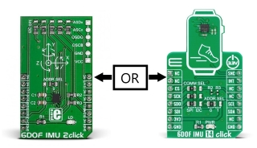
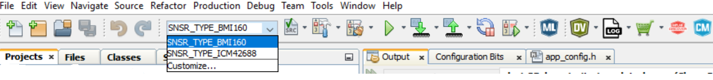
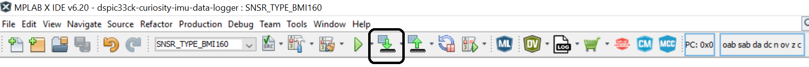
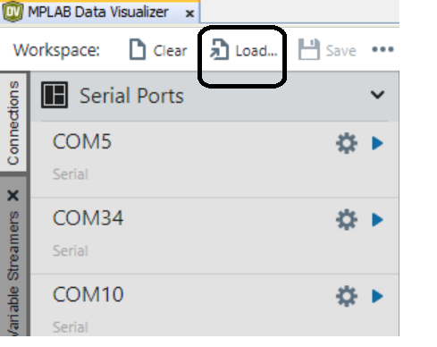
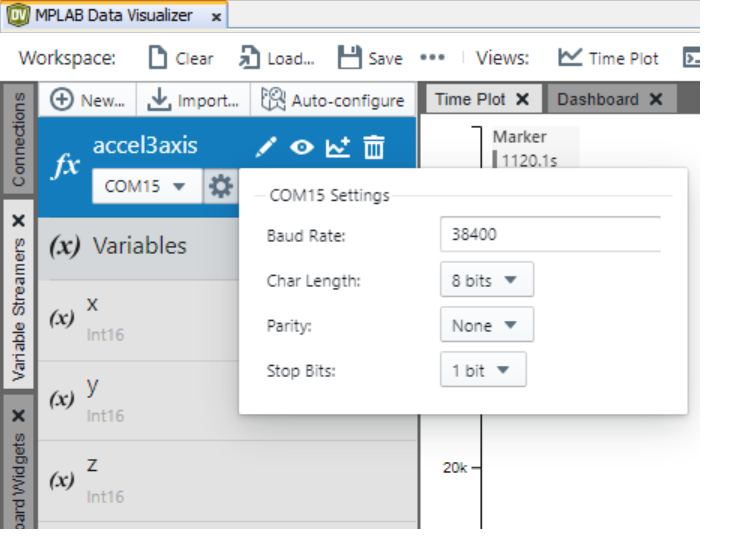
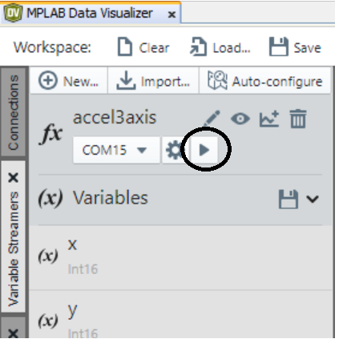
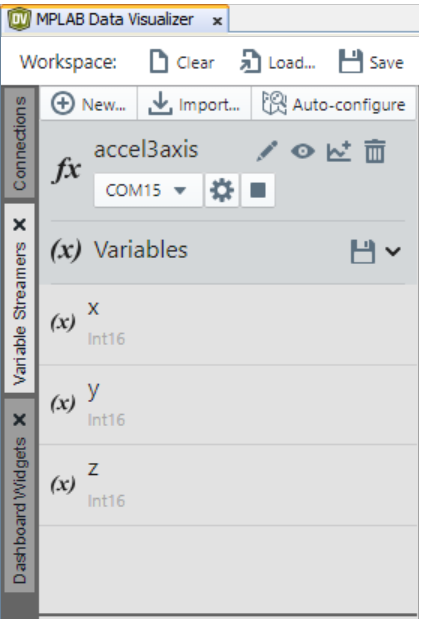
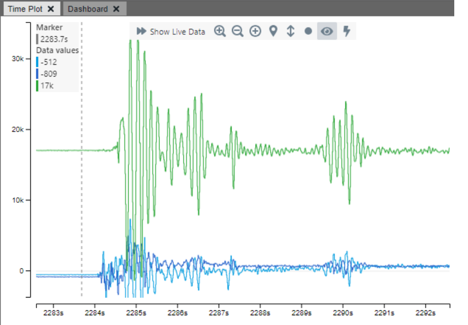

<picture>
    <source media="(prefers-color-scheme: dark)" srcset="images/microchip_logo_white_red.png">
	<source media="(prefers-color-scheme: light)" srcset="images/microchip_logo_black_red.png">
    
</picture> 

# dSPIC33CK Curiosity IMU Data Logger

## Repository Overview
This repository contains firmware for streaming up to 3-axes IMU data over UART from the dSPIC33C Curiosity board with Base board and Mikroe IMU2 or IMU14 Click boards, streaming using MPLAB Data Visualizer stream.

|  |
| :--: |
| *Compatible MikroE Click Boards* |

## Hardware Used

* DSPIC33CK CURIOSITY DEVELOPMENT BOARD [(DM330030)](https://www.microchip.com/en-us/development-tool/dm330030)

* [IMU 2 click board](https://www.mikroe.com/6dof-imu-2-click)
* [IMU 14 click board](https://www.mikroe.com/6dof-imu-14-click)

## Software Used
* [MPLAB® X IDE](https://microchip.com/mplab/mplab-x-ide)
* [MPLAB® XC16 compiler](https://microchip.com/mplab/compilers)
* [MPLAB® Code Configurator](https://www.microchip.com/mcc)
* [MPLAB® Data Visualizer](https://www.microchip.com/en-us/tools-resources/debug/mplab-data-visualizer)

## Related Documentation
* dSPIC33CK [Product Family Page](https://www.microchip.com/en-us/product/dsPIC33CK256MP508)

## How to Configure, Compile, and Flash
The steps below explain the process of configuring the the data logger firmware build, compiling it, and flashing it to the dSPIC33CK device.

1. Plug the dSPIC33CK Curiosity Board into your PC via USB.
2. Install the MPLAB X IDE and XC16 compiler. These are required to load the data logger project and to program the dSPIC33CK Curiosity Board.
3. Open the `dspic33ck-curiosity-imu-data-logger.X` project folder in MPLAB X.
4. Select the appropriate MPLAB X Project Configuration for your sensor according to the table below.
   | Sensor Type | MPLAB X Project Configuration Selection |
   | --- | --- |
   | Bosch BMI160 IMU | `SNSR_TYPE_BMI160` |
   | TDK ICM42688 IMU | `SNSR_TYPE_ICM42688` |

 Project configuration can be set in the MPLAB X toolbar drop down menu as shown in the image below

   |  |
   | :--: |
   | *MPLAB X Project Configuration Selection* |

5. Modify high level sensor parameters like sample rate (`SNSR_SAMPLE_RATE`), by changing the macro values defined in `app_config.h`. See the inline comments for further description.

6. Once you're satistfied with your configuration, click the *Make and Program Device* button in the toolbar (see image below for reference).
   |  |
   | :--: |
   | *Make and Program Device* |

# Firmware Operation
The data streamer firmware will output sensor data over the UART port with the following UART settings:

* Baudrate 38400
* Data bits 8
* Stop bits 1
* Parity None

In addition, the onboard LED3 will indicate firmware status as summarized in the table below:

| State |	LED Behavior |	Description |
| --- | --- | --- |
| Streaming |	LED3 (GREEN) blink |	Data is streaming. |
| Error |	LED3 (RED) |	Fatal error. (Do you have the correct sensor plugged in?). |
| Buffer Overflow |	LED3 (YELLOW) on for 5 seconds	| Processing is not able to keep up with real-time; data buffer has been reset. |

# Usage with the MPLAB Data Visualizer and Machine Learning Plugins
This project can be used to generate firmware for streaming data to the [MPLAB Data Visualizer plugin](https://www.microchip.com/en-us/development-tools-tools-and-software/embedded-software-center/mplab-data-visualizer).  Once the firmware is flashed, follow the steps below to set up Data Visualizer.

1. Connect the Curiosity board to your computer, open up MPLAB X, and open the Data Visualizer plugin.
2. Click the *Load Workspace* button as highlighted in the image below. Select one of the workspace files included in this repository - located under the `dv-workspace` folder - whose name most closely describes your sensor configuration; you can always modify the configuration once it is loaded if needed.

|  |
| :--: |
| *Loading the workspace file* |

3. Next, select the Serial/CDC Connection that corresponds to the Curiosity board, adjust the baud rate to 38400.

|  |
| :--: |
| *Configuring the dSPIC33CK serial port* |

4. Use the play button on the Serial/CDC Connection to connect to the serial port. Once the connection is made, the dSPIC33CK will be available for use with the variable streamer.

|  |
| :--: |
| *Start Streaming* |

5. Switch to the *Variable Streamers* tab and select the aforementioned Serial/CDC Connection from the drop down menu as the input data source for the IMU variable streamer (see image below for reference); this will enable parsing of the dSPIC33CK data stream. You may delete or add variables here if your sensor configuration differs from the pre-loaded ones.

|  |
| :--: |
| *Variable streamer data source selection* |

The IMU data should now be available in the time plot. 

|  |
| :--: |
| *Data Visualizer Time Plot* |

Visit the [Machine Learning Plugin page](https://microchipdeveloper.com/machine-learning:ml-plugin) to learn more about using the Data Visualizer plugin to export your data for machine learning applications.